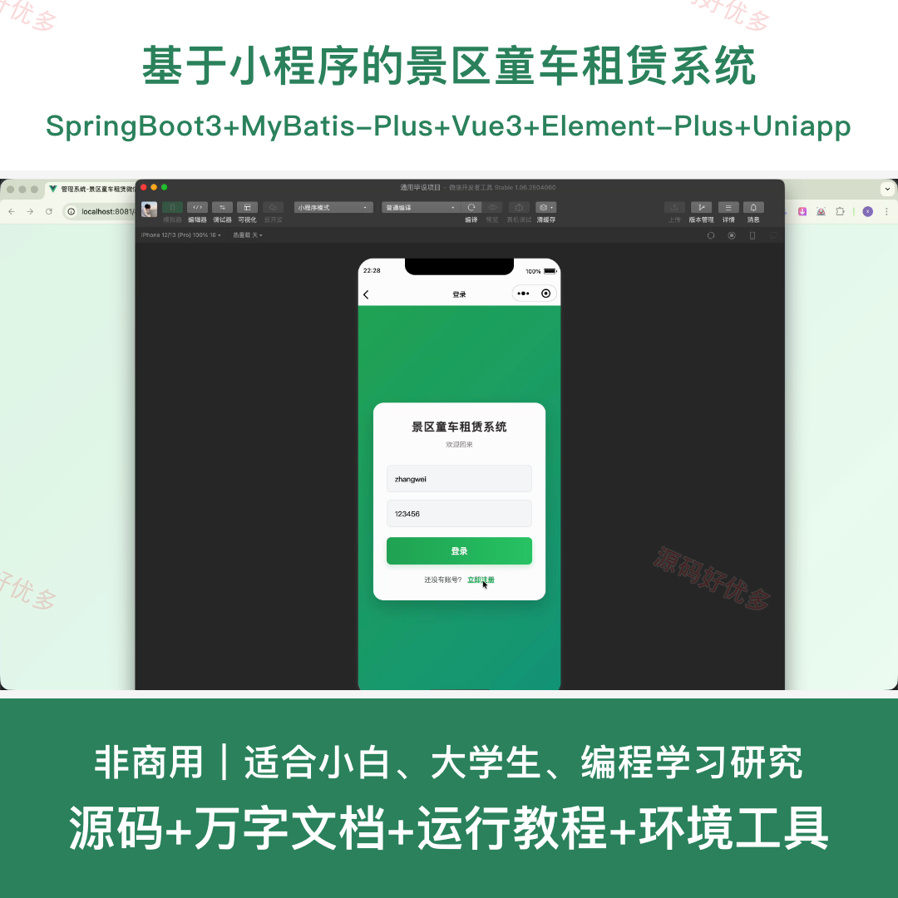
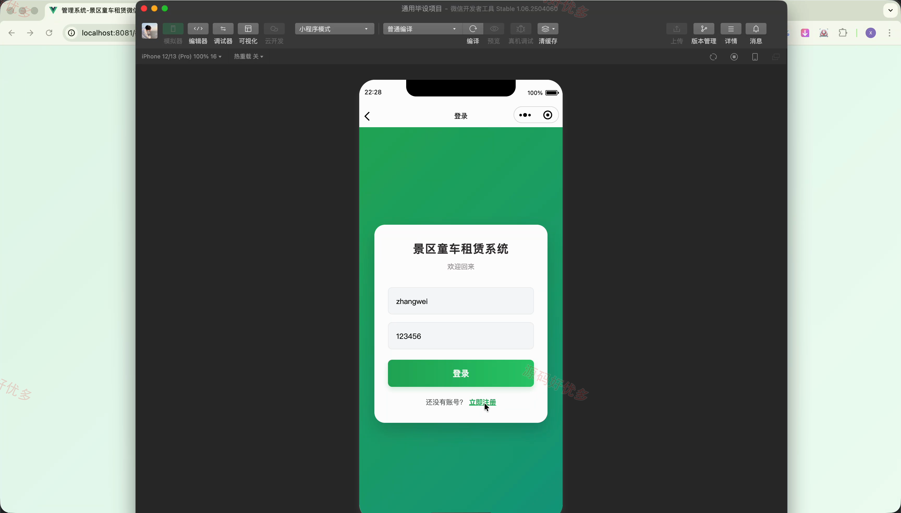
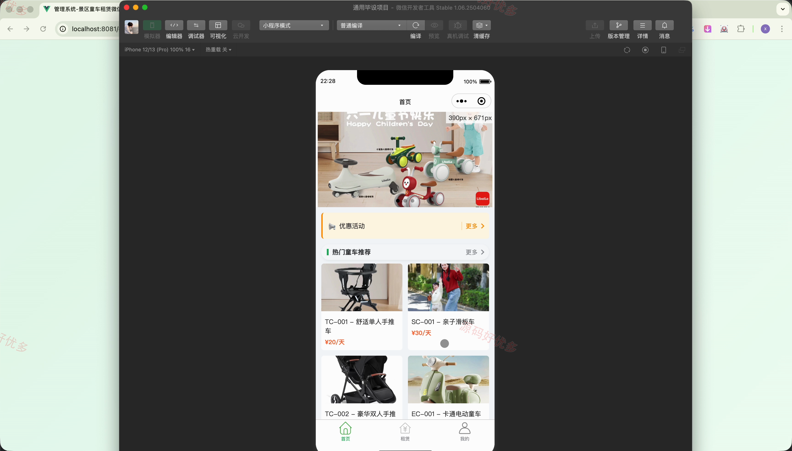
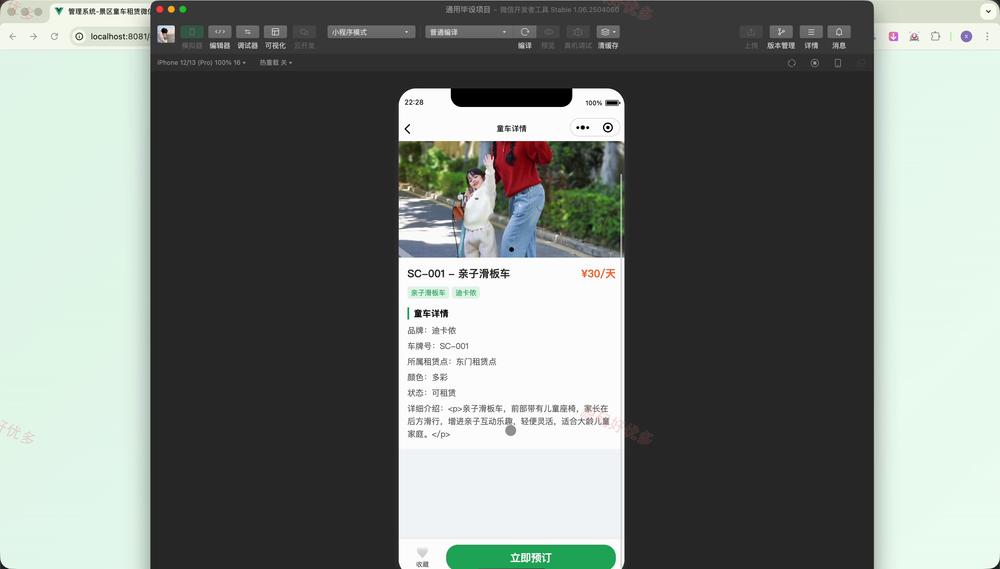
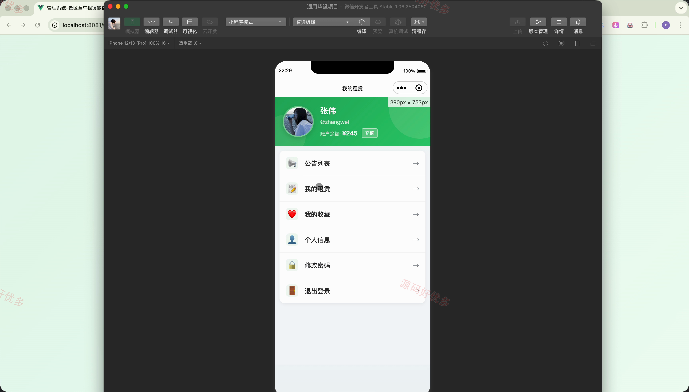
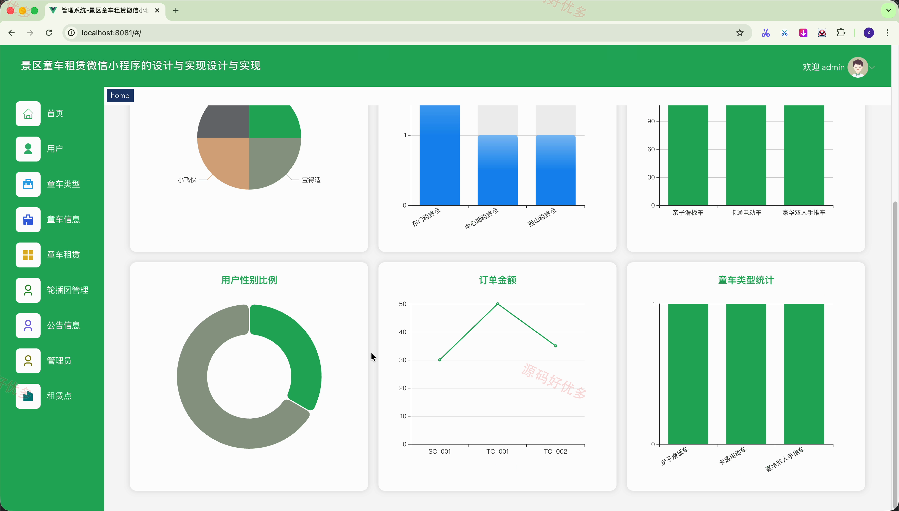
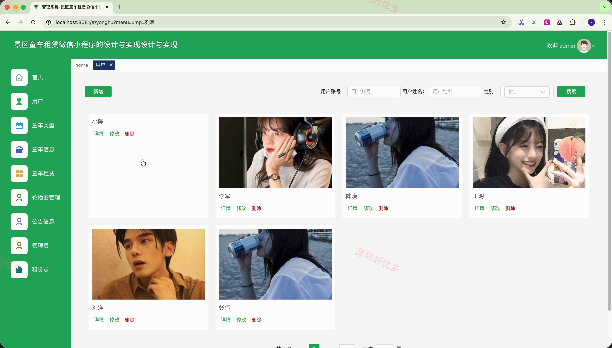
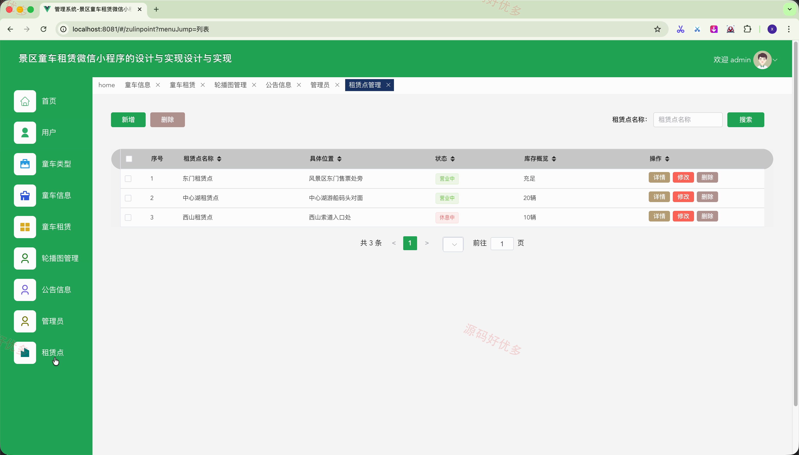
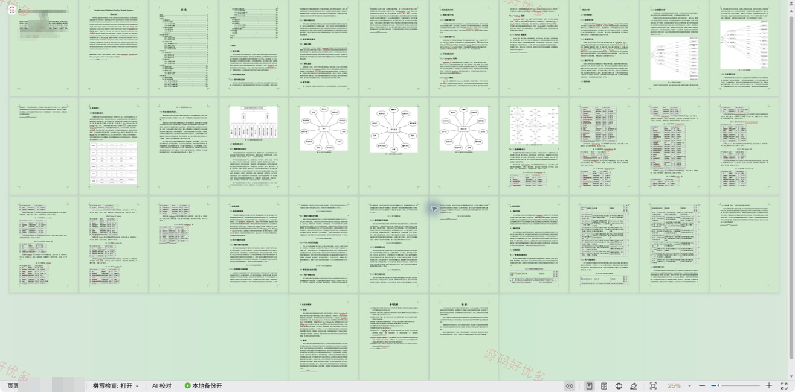

# mpweixinA266-
mpweixinA266 基于微信小程序的景区童车租赁系统
## 源码问题查看主页咨询

### 一、关键词
微信小程序、景区童车租赁系统、景区童车租赁、景区童车租赁信息管理、景区童车租赁后台管理

### 二、作品包含
源码+数据库+万字设计文档+全套环境和工具资源+本地部署教程

### 三、项目技术
前端技术： Html、Css、Js、Vue3.2、Element-Plus、uniapp
后端技术：Java、SpringBoot3.3.0、MyBatis-Plus

### 四、运行环境（以下版本亲测，其他版本兼容性请自行测试）
开发工具：IDEA/eclipse + VSCODE + HBuilder X + 微信开发者工具

数据库：MySQL8.0+（共15张表）

数据库管理工具：Navicat10以上版本

环境配置软件： JDK17 + Maven3.6.3

前端Nodejs：16+

浏览器：谷歌浏览器

### 五、项目介绍
项目编号：mpweixinA266

基于微信小程序的景区童车租赁系统面向管理员、用户，提供童车类型管理、童车信息管理、租赁管理、轮播图管理、公告信息、管理员管理、租赁点管理等功能，实现各角色在系统中的实际业务协作。

角色：管理员、用户

管理员功能：后台登录、用户管理、童车类型管理、童车信息管理、租赁管理、轮播图与公告管理、管理员管理、租赁点管理。

用户功能：前台登录、前台注册、童车信息查看、童车信息租赁、新闻资讯查看、童车信息支付。

### 六、运行截图

